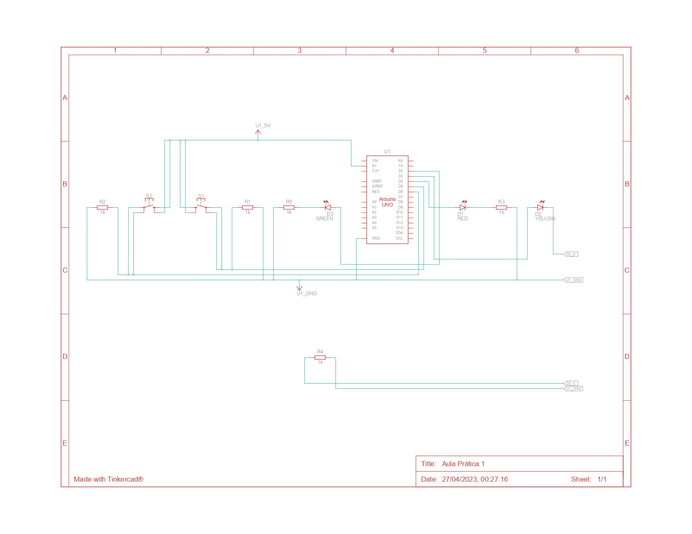
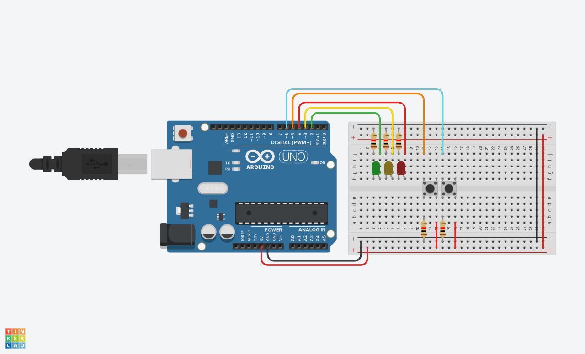

# Arduino-Parking-Lot

Este projeto simula um sistema de estacionamento usando Arduino, sensores e LEDs. Ele detecta a entrada e saída de carros e mostra a disponibilidade de vagas usando cores diferentes.

## Como funciona

O projeto usa dois sensores (S1 e S2) para detectar a entrada e saída de carros, e três LEDs (verde, amarelo e vermelho) para indicar a disponibilidade de vagas. A lógica do sistema é a seguinte:

- Se não há carros no estacionamento, o LED verde fica aceso e os outros apagados.
- Se há pelo menos um carro no estacionamento, mas ainda há vagas, o LED amarelo fica aceso e os outros apagados.
- Se o estacionamento está lotado, o LED vermelho fica aceso e os outros apagados.

O código Arduino C++ define duas classes: LED e Switch, para representar os componentes de hardware. A classe LED tem métodos para ligar e desligar o LED, e a classe Switch tem métodos para ler o estado do sensor.

## Imagens

Esquema do projeto.

Imagem do projeto montado em uma protoboard.

## Licença

Este projeto está licenciado sob a licença MIT. Veja o arquivo [LICENSE](LICENSE) para mais detalhes.